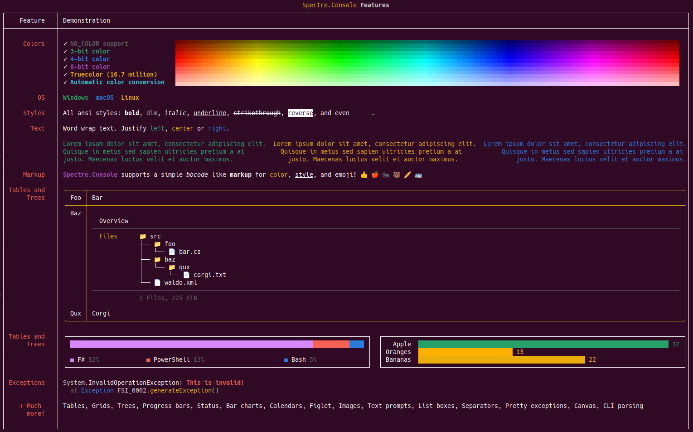

# FsSpectre

[](https://ci.appveyor.com/project/galassie/fs-spectre)

[Spectre.Console](https://spectreconsole.net/) with F# style.

FsSpectre is a small library that extends Spectre.Console and allow to write beautiful console applications in a declarative and more F#-friendly way.
It leverages [Computation Expressions](https://learn.microsoft.com/en-us/dotnet/fsharp/language-reference/computation-expressions) to create the widgets in a declarative style.

## Add package

If you want to add this package to your project, execute the following command:

``` shell
dotnet add package FsSpectre
```

## Build on your machine

If you want to build this library on your machine, execute the following commands:

``` shell
git clone git@github.com:galassie/fs-spectre.git
cd fs-spectre
dotnet build
```

## Showcase

To see an example, execute the `Showcase.fsx` with the following command (you need to build the library first):

``` shell
dotnet fsi Showcase.fsx
```



## Contributing

Code contributions are more than welcome! 😻

Please commit any pull requests against the `master` branch.  
If you find any issue, please [report it](https://github.com/galassie/fs-spectre/issues)!

## License

This project is licensed under [The MIT License (MIT)](https://raw.githubusercontent.com/galassie/fs-spectre/master/LICENSE.md).

Author: [Enrico Galassi](https://twitter.com/enricogalassi88)